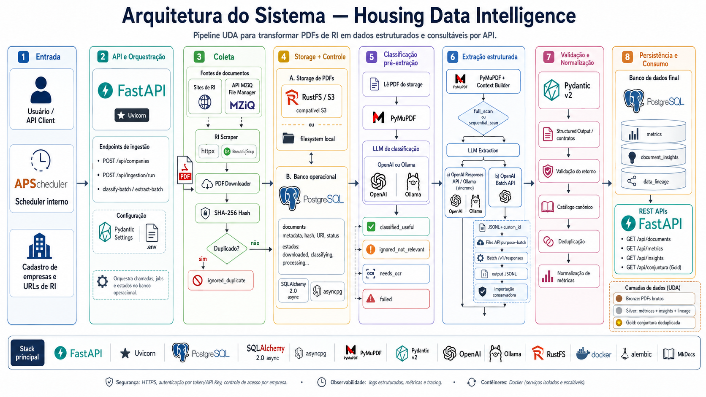

# Housing Data Intelligence

Pipeline UDA (Unstructured Data Analysis) para coletar documentos não estruturados do mercado habitacional, extrair métricas com LLM, validar a saída por contrato Pydantic e disponibilizar dados estruturados para análise de conjuntura.

O projeto foi desenhado para transformar PDFs de Relações com Investidores, resultados trimestrais, prévias operacionais e boletins de conjuntura em dados relacionais com rastreabilidade de origem.

## Autoria e Repositório

- Autor: Lucas Guimarães Borges

## Objetivo

Transformar documentos não estruturados em métricas habitacionais auditáveis:

- coleta automatizada de PDFs;
- idempotência por hash SHA-256;
- parsing de PDF com PyMuPDF;
- seleção de contexto por full scan ou chunking semântico;
- extração estruturada via Ollama local ou OpenAI Responses API em lote;
- validação de saída com Pydantic;
- normalização por catálogo canônico de métricas;
- persistência em PostgreSQL;
- storage local ou RustFS S3-compatible;
- linhagem por documento, página, trecho, modelo e versão de prompt;
- API REST para empresas, documentos, métricas e conjuntura.

## Stack

- Python 3.12+
- FastAPI
- SQLAlchemy 2.0 + asyncpg
- Alembic
- Pydantic v2
- PyMuPDF
- OpenAI SDK
- Ollama
- PostgreSQL
- RustFS
- MkDocs Material
- Docker Compose
- pytest + Testcontainers
- Ruff

## Arquitetura



> Figura: Fluxo do pipeline UDA — ingestão, storage (local/RustFS), extração (PDF parser, chunking, LLM), contrato Pydantic, catálogo de métricas, persistência (PostgreSQL) e API FastAPI.

Módulos principais:

| Módulo | Responsabilidade |
| --- | --- |
| `app/core` | Configuração, banco, logging e utilitários. |
| `app/modules/companies` | Cadastro de empresas e fontes RI. |
| `app/modules/ingestion` | Scraping, download, hash, idempotência e scheduler diário. |
| `app/modules/extraction` | Parsing, chunking, cliente LLM e persistência da extração. |
| `app/modules/documents` | Catálogo e status de documentos. |
| `app/modules/metrics` | Métricas, catálogo canônico e endpoint de conjuntura. |
| `app/modules/lineage` | Linhagem dos dados extraídos. |
| `app/modules/storage` | Storage local ou S3-compatible. |

## Documentação

A documentação técnica fica em MkDocs Material.

Rodar localmente:

```bash
uv sync --extra dev
uv run --extra dev mkdocs serve
```

Build strict:

```bash
uv run --extra dev mkdocs build --strict
```

Com Docker Compose, a documentação sobe junto:

- Dev: `http://localhost:8001`
- Prod: `http://localhost:8001`

Arquivos principais:

- `mkdocs.yml`
- `docs/index.md`
- `docs/projeto/arquitetura.md`
- `docs/projeto/fluxo-de-dados.md`
- `docs/ambiente/configuracao.md`
- `docs/como_rodar_com_compose.md`

## Configuração

Crie o `.env`:

```bash
cp .env.example .env
```

Variáveis mais importantes:

| Variável | Uso |
| --- | --- |
| `DATABASE_URL` | URL SQLAlchemy async do PostgreSQL. |
| `POSTGRES_DB`, `POSTGRES_USER`, `POSTGRES_PASSWORD` | Credenciais do PostgreSQL no Compose. |
| `LLM_PROVIDER` | `ollama` para execução local ou `openai` para extração remota em lote. |
| `OPENAI_API_KEY` | Chave da OpenAI quando `LLM_PROVIDER=openai`. |
| `OPENAI_MODEL` | Modelo usado pelo cliente OpenAI. |
| `OLLAMA_BASE_URL`, `OLLAMA_MODEL` | Endpoint e modelo usados quando `LLM_PROVIDER=ollama`. |
| `ENABLE_INGESTION_SCHEDULER` | Habilita o ciclo diário junto da API. |
| `INGESTION_SCHEDULE_HOUR`, `INGESTION_SCHEDULE_MINUTE` | Horário diário do ciclo; padrão `02:00`. |
| `SCHEDULER_TIMEZONE` | Timezone do scheduler; padrão `America/Sao_Paulo`. |
| `STORAGE_BACKEND` | `local` ou `rustfs`. |
| `RUSTFS_*` | Configurações do RustFS. |
| `API_PORT`, `DOCS_PORT`, `POSTGRES_PORT` | Portas publicadas pelos composes. |

Para extração local sem custo de API externa:

```env
LLM_PROVIDER=ollama
OLLAMA_BASE_URL=http://localhost:11434
OLLAMA_MODEL=llama3.1
```

Para extração com OpenAI:

```env
LLM_PROVIDER=openai
OPENAI_API_KEY=sk-...
OPENAI_MODEL=gpt-4.1-mini
```

Quando `LLM_PROVIDER=openai`, documentos pendentes são agrupados por
`EXTRACTION_BATCH_SIZE` para reduzir overhead de prompt e chamadas. Quando
`LLM_PROVIDER=ollama`, a extração é local e cada documento do lote é processado
sequencialmente.

## Docker Compose

Stacks disponíveis:

- `compose.dev.yml`
- `compose.prod.yml`

### Desenvolvimento

Sobe API, PostgreSQL, RustFS e MkDocs com reload/bind mount:

```bash
docker compose --env-file .env -f compose.dev.yml up --build
```

Atalhos:

```bash
uv run task compose_up
uv run task compose_down
```

Serviços:

| Serviço | URL |
| --- | --- |
| API | `http://localhost:8000` |
| Swagger/OpenAPI | `http://localhost:8000/docs` |
| MkDocs | `http://localhost:8001` |
| PostgreSQL | `localhost:5432` |
| RustFS S3 API | `http://localhost:9000` |
| RustFS Console | `http://localhost:9001` |

### Produção

Usa imagem de API sem dependências dev e docs estático servido por Nginx:

```bash
docker compose --env-file .env -f compose.prod.yml up --build -d
```

Atalhos:

```bash
uv run task compose_prod_up
uv run task compose_prod_down
```

## Dockerfiles

Imagens disponíveis:

| Arquivo | Uso |
| --- | --- |
| `Dockerfile.dev` | Ambiente de desenvolvimento, API com reload e MkDocs serve. |
| `Dockerfile.prod` | Targets `api` e `docs` para produção. |

Build manual:

```bash
docker build -f Dockerfile.dev -t hdi-dev .
docker build -f Dockerfile.prod --target api -t hdi-api .
docker build -f Dockerfile.prod --target docs -t hdi-docs .
```

## Execução Local Sem Docker

Instale dependências:

```bash
uv sync --extra dev
```

Rode migrations:

```bash
uv run alembic upgrade head
```

Suba a API:

```bash
uv run uvicorn app.main:app --reload
```

Com scheduler diário às 02:00:

```bash
ENABLE_INGESTION_SCHEDULER=true uv run uvicorn app.main:app --reload
```

Executar o ciclo diário sob demanda via CLI:

```bash
uv run python -m app.modules.ingestion.scheduler
```

## Endpoints Principais

| Endpoint | Uso |
| --- | --- |
| `GET /health` | Saúde da API. |
| `POST /api/companies` | Cadastrar empresa. |
| `GET /api/companies` | Listar empresas. |
| `POST /api/ingestion/run` | Rodar ciclo geral: ingestão de novidades e extração em lote. |
| `POST /api/ingestion/run/{company_id}` | Rodar ciclo por empresa. |
| `POST /api/ingestion/extract-batch` | Extrair um lote de documentos pendentes. |
| `GET /api/documents` | Listar documentos. |
| `GET /api/metrics` | Listar métricas brutas. |
| `GET /api/conjuntura` | Consultar camada Gold de conjuntura. |

Exemplo:

```bash
curl "http://localhost:8000/api/conjuntura?empresa=MRV&ano=2025&trimestre=3"
```

## Métricas, Catálogo e Camada Gold

O catálogo em `app/modules/metrics/catalog.py` padroniza nomes e aliases de métricas habitacionais.

Exemplo:

| Alias | Nome canônico |
| --- | --- |
| `vendas contratadas líquidas` | `vendas_liquidas` |
| `valor geral de vendas lançado` | `vgv_lancado` |
| `dívida líquida` | `divida_liquida` |

A API mantém duas visões:

- `/api/metrics`: visão bruta e auditável;
- `/api/conjuntura`: camada Gold, deduplicada por métrica canônica e ordenada por qualidade de evidência.

## Linhagem

Cada métrica persistida gera registro em `data_lineage` com:

- `document_id`;
- `metric_id`;
- `original_url`;
- `file_hash`;
- `source_page`;
- `source_excerpt`;
- `extraction_model`;
- `extraction_prompt_version`;
- `extracted_at`.

## Testes e Lint

Rodar lint:

```bash
uv run --extra dev ruff check app tests
```

Rodar testes:

```bash
uv run --extra dev pytest -q
```

Os testes usam Testcontainers para subir PostgreSQL efêmero. Docker precisa estar disponível.

## CI/CD

O workflow em `.github/workflows/ci.yml` roda:

- Ruff;
- pytest;
- `mkdocs build --strict`;
- deploy do MkDocs no GitHub Pages em push para `main`.

Para o deploy funcionar, configure no GitHub:

```text
Settings -> Pages -> Build and deployment -> Source: GitHub Actions
```

## GitHub Pages

O MkDocs é publicado automaticamente pelo GitHub Actions quando há push para `main`.

Em pull requests, o workflow apenas valida lint, testes e build da documentação.

## Limitações Conhecidas

- Scraper usa heurísticas gerais para links de PDF.
- OpenAI depende de chave ativa; Ollama depende do servidor local e do modelo baixado.
- Chunking ainda é semântico simples, sem embeddings vetoriais.
- Parser de tabelas avançadas ainda não está habilitado.

## Próximos Passos

- Adicionar endpoint dedicado de linhagem.
- Melhorar detecção contextual de período.
- Implementar retries/circuit breaker na ingestão.
- Expandir catálogo de métricas.
- Adicionar recuperação semântica com embeddings para documentos longos.
