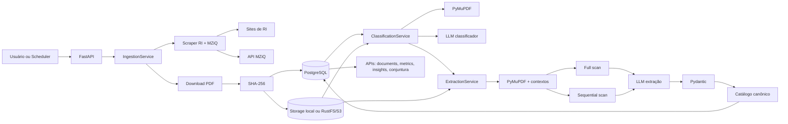
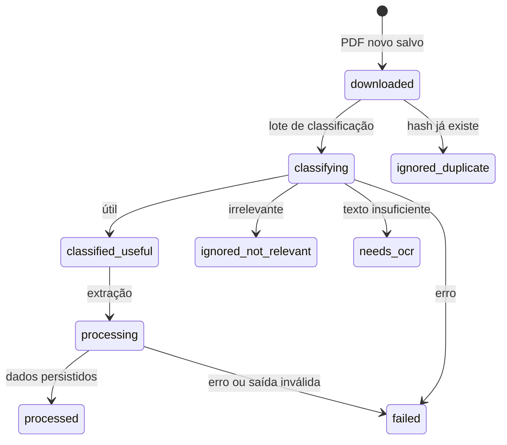
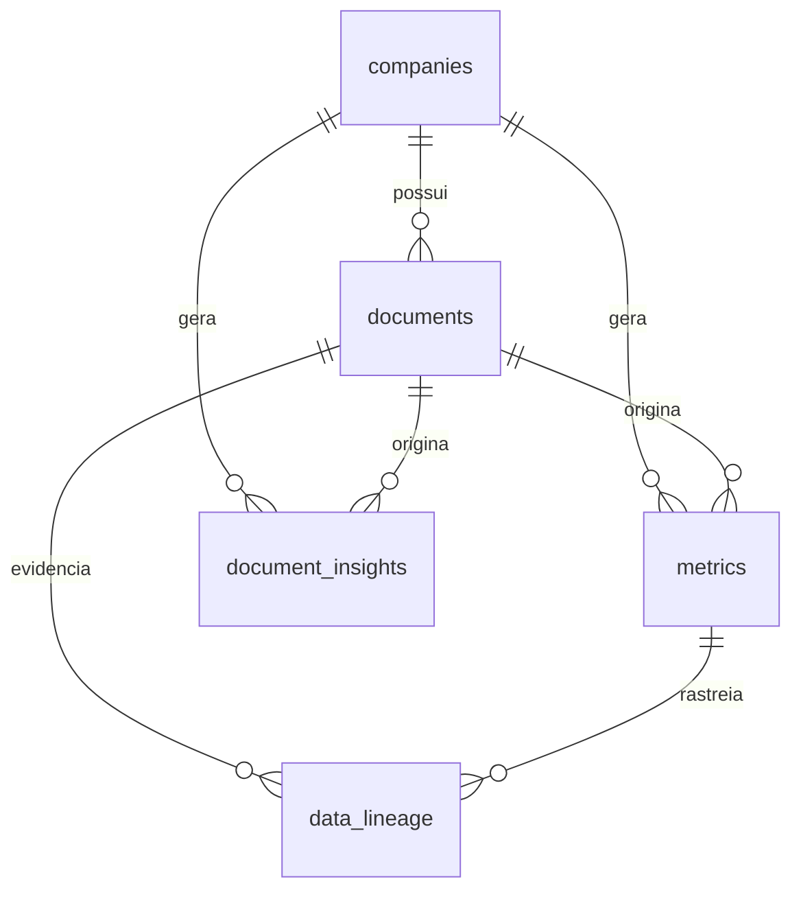

# Operação do Pipeline

Esta página descreve o funcionamento ponta a ponta da aplicação: entrada, coleta,
classificação, extração, OpenAI Batch API, persistência e consulta.

## Visão Executiva

O Housing Data Intelligence transforma documentos não estruturados do mercado
habitacional em dados estruturados e auditáveis.

O fluxo principal é:

1. cadastrar empresas e URLs de RI;
2. descobrir PDFs novos em páginas de RI e centrais MZiQ;
3. baixar PDFs e calcular hash SHA-256;
4. persistir o arquivo em storage local ou RustFS/S3;
5. registrar o documento no PostgreSQL;
6. classificar se o documento é útil, irrelevante ou dependente de OCR;
7. extrair métricas e insights com LLM;
8. validar a resposta com Pydantic;
9. normalizar métricas por catálogo canônico;
10. persistir métricas, insights e linhagem;
11. expor resultados por API REST.

## Componentes Envolvidos

| Componente | Responsabilidade |
| --- | --- |
| FastAPI | Expõe endpoints e injeta serviços por módulo. |
| APScheduler | Executa o ciclo diário quando habilitado. |
| RIScraper | Descobre PDFs em HTML e integra com File Manager MZiQ. |
| PDFDownloader | Baixa bytes do PDF. |
| ObjectStorage | Grava e lê PDFs em filesystem local ou RustFS/S3. |
| PostgreSQL | Guarda empresas, documentos, métricas, insights e linhagem. |
| ClassificationService | Filtra documentos antes da extração cara. |
| ExtractionService | Parseia PDFs, monta contextos, chama LLM e persiste resultados. |
| OpenAI/Ollama | Providers de classificação e extração semântica. |
| Metric Catalog | Normaliza nomes, aliases, unidade, moeda e prioridade. |

## Diagrama Geral



## Formas de Disparo

| Disparo | Como funciona |
| --- | --- |
| Manual completo | `POST /api/ingestion/run` executa ingestão, classificação e extração. |
| Manual por empresa | `POST /api/ingestion/run/{company_id}` restringe o ciclo a uma empresa ativa. |
| Lotes manuais | `classify-batch`, `extract-batch` e endpoints OpenAI Batch permitem controlar etapas separadamente. |
| Scheduler | `ENABLE_INGESTION_SCHEDULER=true` inicia o ciclo diário no lifespan da API. |
| CLI | `python -m app.modules.ingestion.scheduler` roda o ciclo em uma sessão independente. |

## Etapas do Ciclo

### 1. Cadastro

Empresas ficam em `companies` com nome, ticker, URL de RI e flag `is_active`.
A ingestão considera apenas empresas ativas.

### 2. Descoberta

`RIScraper.find_pdf_links()` lê a URL de RI da empresa e retorna candidatos com
`url`, `title` e `score`.

O scraper usa duas estratégias:

- links estáticos `<a href>` do HTML;
- File Manager MZiQ, quando a página monta a central de resultados via
  JavaScript/API.

No caminho MZiQ, o scraper extrai `fmId`, `fmBase`, idioma e categorias, depois
chama o endpoint de metadados para listar documentos publicados. O objetivo é
capturar releases, prévias operacionais e ITR/DFP que não aparecem no HTML inicial.

### 3. Download, Hash e Idempotência

Para cada candidato:

1. o PDF é baixado;
2. o hash SHA-256 é calculado;
3. o banco é consultado por `documents.file_hash`;
4. se o hash já existir, o novo registro fica `ignored_duplicate`;
5. se for novo, o arquivo é salvo e o documento fica `downloaded`.

Essa regra evita reprocessar o mesmo PDF quando ele aparece com URLs diferentes.

### 4. Storage

O banco não guarda o PDF inteiro. Ele guarda metadados e a URI em
`documents.local_path`.

| Backend | URI persistida | Uso comum |
| --- | --- | --- |
| Local | `file://...` | Desenvolvimento sem S3. |
| RustFS/S3 | `s3://bucket/key` | Execução com Docker Compose ou storage compatível. |

### 5. Classificação

A classificação reduz custo e ruído antes da extração completa.

Fluxo:

1. seleciona documentos `downloaded`;
2. marca como `classifying`;
3. lê o PDF do storage;
4. extrai texto com PyMuPDF;
5. se houver pouco texto, marca `needs_ocr`;
6. monta amostra com páginas iniciais e trechos relevantes;
7. chama a LLM com o contrato `DocumentClassification`;
8. atualiza status e metadados de classificação.

Saídas possíveis:

| Saída | Status |
| --- | --- |
| Útil | `classified_useful` |
| Irrelevante | `ignored_not_relevant` |
| Sem texto suficiente | `needs_ocr` |
| Erro de leitura, storage, LLM ou contrato | `failed` |

### 6. Extração Síncrona

`POST /api/ingestion/extract-batch` seleciona documentos `classified_useful`,
marca como `processing` e processa cada documento.

O parser extrai texto por página. O serviço decide entre:

| Estratégia | Quando usa | Como funciona |
| --- | --- | --- |
| `full_scan` | Documento cabe em `EXTRACTION_FULL_SCAN_MAX_CHARS`. | Envia o texto inteiro em um contexto. |
| `sequential_scan` | Documento excede o limite do full scan. | Divide o documento em partes sequenciais de até `EXTRACTION_CONTEXT_MAX_CHARS`. |

No modo sequencial, o sistema percorre o documento inteiro em partes menores,
preservando marcadores de página. Depois consolida e deduplica métricas e insights.

### 7. OpenAI Batch API

O fluxo assíncrono é usado apenas com `LLM_PROVIDER=openai` e serve para
processamento offline.

Endpoints:

```http
POST /api/ingestion/openai-batch/submit?batch_size=1
GET /api/ingestion/openai-batch/{batch_id}
POST /api/ingestion/openai-batch/{batch_id}/import
```

No `submit`:

1. seleciona documentos `classified_useful`;
2. parseia cada PDF e cria contextos;
3. gera uma linha JSONL por parte documental;
4. usa `custom_id` no formato `document-{id}-part-{n}-of-{total}`;
5. monta requests para `/v1/responses`;
6. envia o arquivo pela Files API com `purpose=batch`;
7. cria o batch com `completion_window=24h`;
8. marca os documentos como `processing`.

No `status`, a aplicação consulta `client.batches.retrieve(batch_id)` e retorna o
objeto do batch.

No `import`:

1. a aplicação só continua se `status == completed`;
2. baixa `output_file_id`;
3. parseia o JSONL de saída;
4. agrupa linhas por `document_id` usando `custom_id`;
5. valida cada parte como `ExtractedMetricBatch`;
6. falha o documento se houver erro ou parte faltante;
7. persiste métricas, insights e linhagem quando o grupo está completo.

`EXTRACTION_BATCH_SIZE` controla quantos documentos entram na submissão. O número
de requests OpenAI pode ser maior, porque documentos longos geram várias partes.

## Estados do Documento



| Status | Significado |
| --- | --- |
| `downloaded` | PDF novo salvo, aguardando classificação. |
| `classifying` | Documento em classificação. |
| `classified_useful` | Documento aprovado para extração. |
| `processing` | Documento em extração ou aguardando importação de batch. |
| `processed` | Métricas ou insights persistidos. |
| `failed` | Falha auditável com `error_message`. |
| `ignored_not_relevant` | Documento não útil para o domínio. |
| `ignored_duplicate` | PDF duplicado por hash. |
| `needs_ocr` | PDF sem texto extraível suficiente. |

## Persistência



| Tabela | Conteúdo |
| --- | --- |
| `companies` | Empresas monitoradas. |
| `documents` | PDFs, hash, URI de storage, status e metadados de classificação. |
| `metrics` | Métricas numéricas extraídas e normalizadas. |
| `document_insights` | Fatos documentais qualitativos. |
| `data_lineage` | Evidência de cada métrica: documento, URL, hash, página, trecho, modelo e prompt. |

## Contratos de LLM

Classificação:

- `DocumentClassification`;
- decide utilidade, tipo documental, domínios, período, estratégia e confiança.

Extração:

- `ExtractedMetricBatch`;
- `ExtractedBatchResponse`;
- separa `metrics` de `insights`;
- exige evidência por página, trecho e confiança sempre que possível.

Métricas sem `value` numérico não entram em `metrics`. Informações úteis sem valor
numérico entram em `document_insights`.

## Camadas Analíticas

| Camada | O que representa |
| --- | --- |
| Bronze | PDFs brutos em storage e registros de `documents`. |
| Silver | `metrics`, `document_insights` e `data_lineage`. |
| Gold | `/api/conjuntura`, com métricas canônicas deduplicadas por empresa, ano e trimestre. |

A camada Gold escolhe a melhor evidência por métrica considerando confiança, valor
presente, página, trecho-fonte e aderência ao catálogo.

## Endpoints de Consulta

| Endpoint | Uso |
| --- | --- |
| `GET /api/documents` | Documentos e status de processamento. |
| `GET /api/metrics` | Métricas brutas e auditáveis. |
| `GET /api/insights` | Fatos qualitativos extraídos. |
| `GET /api/conjuntura` | Visão Gold para análise de conjuntura. |

## Pontos Operacionais

| Ponto | Observação |
| --- | --- |
| Custo LLM | A classificação evita extrair documentos irrelevantes. |
| PDFs longos | Um documento pode gerar várias chamadas ou várias linhas JSONL no Batch API. |
| Batch incompleto | Qualquer erro ou parte faltante faz o documento falhar no import. |
| Ordem do output | O import usa `custom_id`, não a ordem do arquivo de saída. |
| Auditabilidade | Cada métrica guarda documento, hash, página, trecho, modelo e versão de prompt. |
| OCR | PDFs escaneados ficam `needs_ocr`; OCR ainda não faz parte do escopo atual. |
